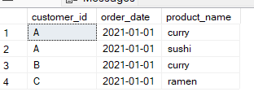
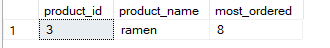
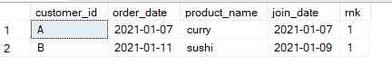
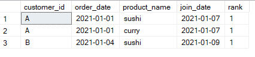
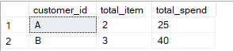
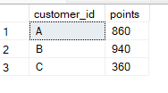
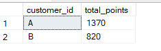
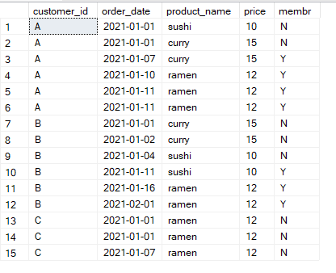
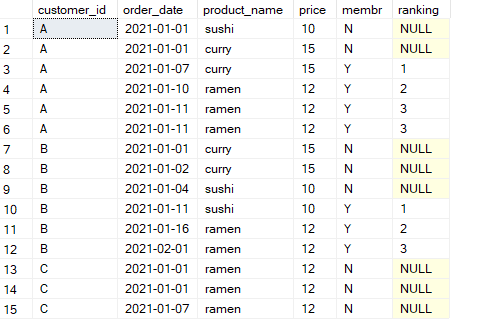

# 🍜 Case Study #1 - Danny's Diner

<p align="center">
  
</p>

View the case study: [Case Study 1](https://8weeksqlchallenge.com/case-study-1/) and my solutions here: [Case Study 1](https://github.com/poojarao76/8-Week-SQL-Challenge/blob/main/Case%20Study%20%231%3A%20Danny's%20Diner/query.sql)

## 📕 Table of Contents

* [Bussiness Task](https://github.com/poojarao76/8-Week-SQL-Challenge/blob/main/Case%20Study%20%231%3A%20Danny's%20Diner/README.md#%EF%B8%8F-bussiness-task)
  
* [Entity Relationship Diagram](https://github.com/poojarao76/8-Week-SQL-Challenge/blob/main/Case%20Study%20%231%3A%20Danny's%20Diner/README.md#-entity-relationship-diagram)

* [Dataset](https://github.com/poojarao76/8-Week-SQL-Challenge/edit/main/Case%20Study%20%231%3A%20Danny's%20Diner/README.md#dataset)

* [Case Study Questions](https://github.com/poojarao76/8-Week-SQL-Challenge/blob/main/Case%20Study%20%231%3A%20Danny's%20Diner/README.md#case-study-questions)

## 🛠️ Bussiness Task

Danny wants to use the data to answer a few simple questions about his customers, especially about their visiting patterns, how much money they’ve spent and also which menu items are their favourite. Having this deeper connection with his customers will help him deliver a better and more personalised experience for his loyal customers.

He plans on using these insights to help him decide whether he should expand the existing customer loyalty program - additionally he needs help to generate some basic datasets so his team can easily inspect the data without needing to use SQL.

Danny has provided you with a sample of his overall customer data due to privacy issues - but he hopes that these examples are enough for you to write fully functioning SQL queries to help him answer his questions!

## 🔐 Entity Relationship Diagram

<p align="center">
  
</p>

## Dataset

1. **Table 1: sales**
  * The sales table captures all customer_id level purchases with a corresponding order_date and product_id information for when and what menu items were ordered.

2. **Table 2: menu**
  * The menu table maps the product_id to the actual product_name and price of each menu item.

3. **Table 3: members**
  * The final members table captures the join_date when a customer_id joined the beta version of the Danny’s Diner loyalty program.

Here is the [link](https://github.com/poojarao76/8-Week-SQL-Challenge/blob/main/Case%20Study%20%231%3A%20Danny's%20Diner/database.sql) for the Schema for the dataset. 

# Case Study Questions & Solutions:

1. What is the total amount each customer spent at the restaurant?

    ```
    SELECT customer_id, SUM(m.price) AS sum_price FROM sales s
    JOIN  menu m
    ON s.product_id=m.product_id
    GROUP BY customer_id;
    ```
    

    
2. What was the first item from the menu purchased by each customer?

    ```
    WITH orderRank AS (
    SELECT 
        customer_id,
        product_id,
        order_date,
        DENSE_RANK() OVER(PARTITION BY customer_id ORDER BY order_date) AS rnk
    FROM sales
    )
    SELECT 
    o.customer_id,
    o.order_date,
    m.product_name
    FROM orderRank o
    JOIN menu m 
    ON o.product_id = m.product_id
    WHERE o.rnk = 1
    GROUP BY o.customer_id, o.order_date, m.product_name;
    ```

    


3. What is the most purchased item on the menu and how many times was it purchased by all customers?

    ```
    SELECT TOP 1 m.product_id, m.product_name, COUNT(s.product_id) most_ordered FROM sales s
    JOIN menu m
    ON s.product_id=m.product_id
    GROUP BY m.product_id, m.product_name
    ORDER BY most_ordered DESC;
    ```

    


4. Which item was the most popular for each customer?

    ```
    WITH most_pop AS (
    SELECT s.customer_id, m.product_name, COUNT(s.product_id) AS most_ordered,
    DENSE_RANK() OVER (PARTITION BY s.customer_id ORDER BY COUNT(s.product_id) DESC) AS rank
    FROM sales s
    JOIN menu m
    ON s.product_id=m.product_id
    GROUP BY s.customer_id, m.product_name
    )
    SELECT customer_id,product_name,most_ordered FROM most_pop
    WHERE rank=1;
    ```

    


5. Which item was purchased first by the customer after they became a member?

    ```
    WITH afterMemb AS (
    SELECT s.customer_id, s.order_date, m.product_name, mm.join_date, 
    DENSE_RANK() OVER(PARTITION BY s.customer_id ORDER BY s.order_date) rnk
    FROM sales s
    JOIN members mm
    ON s.customer_id=mm.customer_id
    JOIN menu m
    ON s.product_id=m.product_id
    WHERE s.order_date>=mm.join_date
    )
    SELECT * FROM afterMemb
    WHERE rnk=1;
    ```

    

6. Which item was purchased just before the customer became a member?

    ```
    WITH orderBeforeMemb AS (
    SELECT s.customer_id, s.order_date, m.product_name, mm.join_date,
    DENSE_RANK() OVER(PARTITION BY s.customer_id ORDER BY s.order_date DESC) rank
    FROM sales s
    JOIN menu m
    ON s.product_id=m.product_id
    JOIN members mm
    ON s.customer_id=mm.customer_id
    WHERE s.order_date < mm.join_date
    )
    SELECT * FROM orderBeforeMemb
    where rank = 1;
    ```

    


7. What is the total items and amount spent for each member before they became a member?

    ```
    SELECT s.customer_id, COUNT(s.product_id) AS total_item, SUM(m.price) AS total_spend
    FROM sales s
    JOIN menu m
    ON s.product_id=m.product_id
    JOIN members mm
    ON s.customer_id=mm.customer_id
    WHERE s.order_date < mm.join_date
    GROUP BY s.customer_id;
    ```

    

8. If each $1 spent equates to 10 points and sushi has a 2x points multiplier - how many points would each customer have?

    ```
    SELECT s.customer_id,
    SUM(CASE 
    WHEN m.product_name='sushi' THEN m.price*20 
    ELSE m.price*10 END) AS points
    FROM sales s
    JOIN menu m
    ON s.product_id=m.product_id
    GROUP BY s.customer_id;
    ```

    

9. In the first week after a customer joins the program (including their join date) they earn 2x points on all items, not just sushi - how many points do customer A and B have at the end of January?

    ```
    WITH programDates AS(
    SELECT customer_id, join_date, DATEADD(day, 6, join_date) AS valid_date, EOMONTH('01-01-2021') AS last_date 
    FROM members
    )
    SELECT p.customer_id, SUM(CASE 
    WHEN s.order_date BETWEEN p.join_date AND p.valid_date THEN m.price*20
    WHEN m.product_name = 'sushi' THEN m.price*20
    ELSE m.price*10 END) AS total_points
    FROM sales s
    JOIN programDates p
    ON s.customer_id=p.customer_id
    JOIN menu m
    ON s.product_id=m.product_id
    WHERE s.order_date <= last_date
    GROUP BY p.customer_id;
    ```

    

10. Join All The Things - Create a table that has these columns: customer_id, order_date, product_name, price, member (Y/N).

    ```
    SELECT s.customer_id, s.order_date, m.product_name, m.price, 
    CASE WHEN s.order_date>=mm.join_date THEN 'Y'
    ELSE 'N' END AS membr
    FROM sales s
    JOIN menu m
    ON s.product_id=m.product_id
    LEFT JOIN members mm
    ON s.customer_id=mm.customer_id
    ```

    


11.  Rank All The Things - Based on the table above, add one column: ranking.

    ```
    WITH customersData AS (
    SELECT s.customer_id, s.order_date, m.product_name, m.price, 
    CASE WHEN s.order_date>=mm.join_date THEN 'Y'
    ELSE 'N' END AS membr
    FROM sales s
    JOIN menu m
    ON s.product_id=m.product_id
    LEFT JOIN members mm
    ON s.customer_id=mm.customer_id
    )
    SELECT *, 
    CASE WHEN membr = 'Y'
    THEN DENSE_RANK() OVER(PARTITION BY customer_id, membr ORDER BY order_date)
    END AS ranking
    FROM customersData;
    ```

