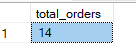
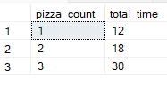
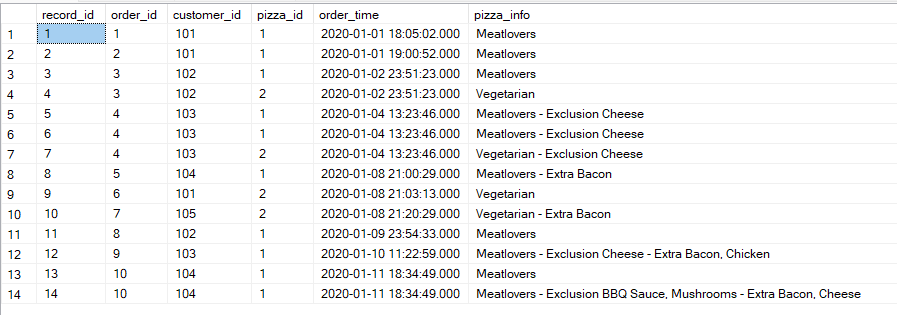
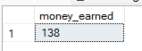

# 🍕 Case Study #2 - Pizza Runner

<p align="center">
  
</p>


## 📚 Table of Contents

* Business Task
* Entity Relationship Diagram
* Dataset
* Data Cleaning and Transformation
* Solution:

    A. Pizza Metrics

    B. Runner and Customer Experience

    C. Ingredient Optimisation

    D. Pricing and Ratings

## Business Task


Danny was scrolling through his Instagram feed when something really caught his eye - “80s Retro Styling and Pizza Is The Future!”

Danny was sold on the idea, but he knew that pizza alone was not going to help him get seed funding to expand his new Pizza Empire - so he had one more genius idea to combine with it - he was going to Uberize it - and so Pizza Runner was launched!

Danny started by recruiting “runners” to deliver fresh pizza from Pizza Runner Headquarters (otherwise known as Danny’s house) and also maxed out his credit card to pay freelance developers to build a mobile app to accept orders from customers.

## Entity Relationship Diagram


## Dataset

1. **Table 1: runners**
* The runners table shows the registration_date for each new runner.

2. **Table 2: customer_orders**
* Customer pizza orders are captured in the customer_orders table with 1 row for each individual pizza that is part of the order.

* The pizza_id relates to the type of pizza which was ordered whilst the exclusions are the ingredient_id values which should be removed from the pizza and the extras are the ingredient_id values which need to be added to the pizza.

* Note that customers can order multiple pizzas in a single order with varying exclusions and extras values even if the pizza is the same type!

3. **Table 3: runner_orders**
* After each orders are received through the system - they are assigned to a runner - however not all orders are fully completed and can be cancelled by the restaurant or the customer.

* The pickup_time is the timestamp at which the runner arrives at the Pizza Runner headquarters to pick up the freshly cooked pizzas. The distance and duration fields are related to how far and long the runner had to travel to deliver the order to the respective customer.

4. **Table 4: pizza_names**
* At the moment - Pizza Runner only has 2 pizzas available the Meat Lovers or Vegetarian!

5. **Table 5: pizza_recipes**
* Each pizza_id has a standard set of toppings which are used as part of the pizza recipe.

6. **Table 6: pizza_toppings**
* This table contains all of the topping_name values with their corresponding topping_id value.

## 🧼 Data Cleaning & Transformation

### A. Pizza Metrics

### 🔨 Table: customer_orders

* The exclusions and extras columns in customer_orders table will need to be cleaned up before using them in the queries
* In the exclusions and extras columns, there are blank spaces and null values.

    ```
    DROP TABLE IF EXISTS #customer_orders_temp;
    SELECT order_id,customer_id,pizza_id,
    CASE 
        WHEN exclusions IS NULL OR exclusions LIKE 'null' OR exclusions = '' THEN NULL
        ELSE exclusions END AS exclusions,
    CASE 
        WHEN extras IS NULL OR extras LIKE 'null' OR extras = '' THEN NULL
        ELSE extras END AS extras,
    order_time
    INTO #customer_orders_temp
    FROM customer_orders;

    SELECT * FROM #customer_orders_temp;
    ```

    

### B. Runner and Customer Experience

### 🔨 Table: runner_orders

* The pickup_time, distance, duration and cancellation columns in runner_orders table will need to be cleaned up before using them in the queries
* In the pickup_time column, there are null values.
* In the distance column, there are null values. It contains unit - km. The 'km' must also be stripped.
* In the duration column, there are null values. The 'minutes', 'mins' 'minute' must be stripped.
* In the cancellation column, there are blank spaces and null values.

    ```
    DROP TABLE IF EXISTS #runner_orders_temp;
    SELECT order_id, runner_id,
    CASE
        WHEN pickup_time='null' THEN NULL
        ELSE pickup_time 
        END AS pickup_time,
    CASE 
        WHEN distance='null' THEN NULL
        WHEN distance LIKE '%km'THEN TRIM('km' FROM distance)
        ELSE distance
        END AS distance,
    CASE 
        WHEN duration = 'null' THEN NULL
        WHEN duration LIKE '% mins' THEN TRIM('mins' FROM duration)
        WHEN duration LIKE '%mins' THEN TRIM('mins' FROM duration)
        WHEN duration LIKE '%minute' THEN TRIM('minute' FROM duration)
        WHEN duration LIKE '%minutes' THEN TRIM('minutes' FROM duration)
        ELSE duration
        END AS duration,
    CASE
        WHEN cancellation = 'null' OR cancellation = '' THEN NULL
        ELSE cancellation
        END AS cancellation
    INTO #runner_orders_temp
    FROM runner_orders;

    SELECT * FROM #runner_orders_temp;
    ```

    


### C. Ingredient Optimisation


### 🔨 Table: customer_orders_temp

-- 1. Create a new temporaray table: #customer_orders_temp

```
SELECT order_id,customer_id,pizza_id,
CASE 
	WHEN exclusions IS NULL OR exclusions LIKE 'null' OR exclusions = '' THEN NULL
	ELSE exclusions END AS exclusions,
CASE 
	WHEN extras IS NULL OR extras LIKE 'null' OR extras = '' THEN NULL
	ELSE extras END AS extras,
order_time
INTO #customer_orders_temp
FROM customer_orders;

SELECT * FROM #customer_orders_temp;


-- Add an identity column record_id to #customer_orders_temp to select each ordered pizza more easily

ALTER TABLE #customer_orders_temp
ADD record_id INT IDENTITY(1,1);

SELECT *
FROM #customer_orders_temp;
```

    


-- 2. Create a new temporaray table: #extrasBreak 

SELECT 
  c.record_id,
  TRIM(e.value) AS extra_id
INTO #extrasBreak 
FROM #customer_orders_temp c
  CROSS APPLY STRING_SPLIT(extras, ',') AS e;

SELECT *
FROM #extrasBreak;

    

-- 3. Create a new temporaray table: #exclusionsBreak

SELECT 
  c.record_id,
  TRIM(e.value) AS exclusion_id
INTO #exclusionsBreak 
FROM #customer_orders_temp c
  CROSS APPLY STRING_SPLIT(exclusions, ',') AS e;

SELECT *
FROM #exclusionsBreak;

     

### 🔨 Table: pizza_toppings

CREATE TABLE #pizza_toppings_split (
    pizza_id INT,
    pizza_name NVARCHAR(50),
    topping_id INT,
    topping_name NVARCHAR(50)
);


INSERT INTO #pizza_toppings_split (pizza_id, pizza_name, topping_id, topping_name)
SELECT pn.pizza_id,
    pn.pizza_name,
    CAST(s.value AS int) AS topping_id,
    pt.topping_name
FROM pizza_recipes pr
JOIN pizza_names pn
ON pr.pizza_id=pn.pizza_id
CROSS APPLY
	string_split(pr.toppings, ',') AS s
JOIN pizza_toppings pt
ON CAST(s.value AS int)=pt.topping_id;


SELECT * FROM #pizza_toppings_split;


    


## Solution:

### A. Pizza Metrics

**1. How many pizzas were ordered?**

```console
SELECT COUNT(order_id) AS total_orders FROM #customer_orders_temp;
```



**2. How many unique customer orders were made?**

```console
SELECT COUNT(DISTINCT order_id) AS unique_customer_orders FROM #customer_orders_temp;
```


**3. How many successful orders were delivered by each runner?**

```console
SELECT runner_id, COUNT(order_id) AS successfull_orders
FROM #runner_orders_temp
WHERE cancellation IS NULL
GROUP BY runner_id;
```


**4. How many of each type of pizza was delivered?**

```console
SELECT c.pizza_id, pn.pizza_name, COUNT(c.order_id) AS total FROM #customer_orders_temp AS c
JOIN pizza_names AS pn
ON c.pizza_id=pn.pizza_id
WHERE C.order_id IN 
(SELECT order_id FROM #runner_orders_temp WHERE cancellation IS NULL)
GROUP BY c.pizza_id, pn.pizza_name;
```


**5. How many Vegetarian and Meatlovers were ordered by each customer?**

```console
SELECT c.customer_id, pn.pizza_name, COUNT(c.pizza_id) AS total_orders
FROM #customer_orders_temp c
JOIN pizza_names pn
ON c.pizza_id=pn.pizza_id
GROUP BY c.customer_id, pn.pizza_name
ORDER BY c.customer_id;
```


**6. What was the maximum number of pizzas delivered in a single order?**

```console
SELECT top 1 customer_id, order_id, COUNT(order_id) AS orders
FROM #customer_orders_temp
GROUP BY customer_id, order_id
ORDER BY orders DESC;
```


**7. For each customer, how many delivered pizzas had at least 1 change and how many had no changes?**

```console
SELECT c.customer_id, 
SUM(CASE
	WHEN (c.exclusions IS NOT NULL or c.extras IS NOT NULL) THEN 1 
	ELSE 0 END) AS atleat_1_change,
SUM(CASE
	WHEN (c.exclusions IS NULL AND c.extras IS NULL) THEN 1
	ELSE 0 END) AS no_change
FROM #customer_orders_temp c
JOIN #runner_orders_temp r
ON c.order_id = r.order_id
WHERE R.cancellation IS NULL
GROUP BY C.customer_id;
```


**8. How many pizzas were delivered that had both exclusions and extras?**

```console
SELECT SUM(CASE WHEN exclusions IS NOT NULL AND extras IS NOT NULL THEN 1 ELSE 0 END) AS total 
FROM #customer_orders_temp c
JOIN #runner_orders_temp r
ON c.order_id=r.order_id
WHERE r.cancellation IS NULL;
```


**9. What was the total volume of pizzas ordered for each hour of the day?**

```console
SELECT DATEPART(HOUR, order_time) AS hr, COUNT(order_id) AS total_order FROM #customer_orders_temp
GROUP BY DATEPART(HOUR, order_time);
```


**10. What was the volume of orders for each day of the week?**

```console
SELECT DATENAME(WEEKDAY, order_time) AS DAY, COUNT(order_id) AS orders
FROM #customer_orders_temp
GROUP BY DATENAME(WEEKDAY, order_time);
```


### B. Runner and Customer Experience

**1. How many runners signed up for each 1 week period? (i.e. week starts 2021-01-01)**

```console
select DATEPART(week, registration_date) as regist_week, count(runner_id) as runner_count from runners
group by DATEPART(week, registration_date);
```


**2. What was the average time in minutes it took for each runner to arrive at the Pizza Runner HQ to pickup the order?**

```console
SELECT ro.runner_id, 
AVG(CAST(DATEDIFF(MINUTE, co.order_time, ro.pickup_time) AS int)) AS avg_time
FROM runner_orders ro
JOIN customer_orders co
ON ro.order_id = co.order_id
WHERE ro.cancellation IS NULL OR ro.cancellation = ''
GROUP BY ro.runner_id;
```


**3. Is there any relationship between the number of pizzas and how long the order takes to prepare?**

```
WITH pizzaPrepTime AS (
SELECT c.order_id, c.order_time, r.pickup_time, DATEDIFF(MINUTE, c.order_time, r.pickup_time) AS prep_time, COUNT(c.pizza_id) AS pizza_count 
FROM #customer_orders_temp c
JOIN #runner_orders_temp r
ON c.order_id=r.order_id
WHERE r.cancellation IS NULL
GROUP BY c.order_id, c.order_time, r.pickup_time, DATEDIFF(MINUTE, c.order_time, r.pickup_time))

SELECT pizza_count, AVG(prep_time) as total_time
FROM pizzaPrepTime
GROUP BY pizza_count;
```



**4. What was the average distance travelled for each customer?**

```console
WITH avgDist AS (
SELECT c.customer_id, ROUND(AVG(CAST(r.distance as float)),2) AS tot_dist
FROM #runner_orders_temp r
JOIN #customer_orders_temp c
ON r.order_id=c.order_id
WHERE (r.cancellation IS NULL)
GROUP BY c.customer_id)

SELECT *
FROM avgDist
```


**5. What was the difference between the longest and shortest delivery times for all orders?**

```console
SELECT MAX(CONVERT(int, duration))-MIN(CONVERT(int, duration)) AS "diff in duration" FROM #runner_orders_temp;
```


**6. What was the average speed for each runner for each delivery and do you notice any trend for these values?**

```
SELECT r.runner_id, r.order_id, r.distance, r.duration, ROUND((CONVERT(float, r.distance)/CONVERT(float, r.duration) * 60), 2) AS [avg delivery time]
FROM #runner_orders_temp r
JOIN #customer_orders_temp c
ON r.order_id=C.order_id
WHERE r.cancellation IS NULL
GROUP BY r.order_id, r.runner_id, r.distance, r.duration
```


**7. What is the successful delivery percentage for each runner?**

```
SELECT runner_id, COUNT(order_id) AS total_orders, COUNT(distance) AS delivered, 100*(COUNT(distance))/COUNT(order_id) AS successful_pct
FROM #runner_orders_temp
GROUP BY runner_id
```


### C. Ingredient Optimisation

**1. What are the standard ingredients for each pizza?**

```
SELECT pizza_name, STRING_AGG(topping_name, ',') AS 'standard ingredients'
FROM #pizza_toppings_split
GROUP BY pizza_name;
```


**2. What was the most commonly added extra?**

```
SELECT 
  p.topping_name,
  COUNT(*) AS extra_count
FROM #extrasBreak e
JOIN pizza_toppings p
  ON e.extra_id = p.topping_id
GROUP BY p.topping_name
ORDER BY COUNT(*) DESC;
```


**3. What was the most common exclusion?**

```
SELECT pt.topping_name, COUNT(*) AS exclusion_count
FROM #exclusionsBreak eb
JOIN #pizza_toppings_split pt
ON eb.exclusion_id=pt.topping_id
GROUP BY pt.topping_name
ORDER BY COUNT(*) DESC;
```


**4. Generate an order item for each record in the customers_orders table in the format of one of the following:
--Meat Lovers
--Meat Lovers - Exclude Beef
--Meat Lovers - Extra Bacon
--Meat Lovers - Exclude Cheese, Bacon - Extra Mushroom, Peppers**

```
WITH cteExtras AS (
  SELECT 
    e.record_id,
    'Extra ' + STRING_AGG(t.topping_name, ', ') AS record_options
  FROM #extrasBreak e
  JOIN pizza_toppings t
    ON e.extra_id = t.topping_id
  GROUP BY e.record_id
), 
cteExclusions AS (
  SELECT 
    e.record_id,
    'Exclusion ' + STRING_AGG(t.topping_name, ', ') AS record_options
  FROM #exclusionsBreak e
  JOIN pizza_toppings t
    ON e.exclusion_id = t.topping_id
  GROUP BY e.record_id
), 
cteUnion AS (
  SELECT * FROM cteExtras
  UNION
  SELECT * FROM cteExclusions
)

SELECT 
  c.record_id,
  c.order_id,
  c.customer_id,
  c.pizza_id,
  c.order_time,
  CONCAT_WS(' - ', p.pizza_name, STRING_AGG(u.record_options, ' - ')) AS pizza_info
FROM #customer_orders_temp c
LEFT JOIN cteUnion u
  ON c.record_id = u.record_id
JOIN pizza_names p
  ON c.pizza_id = p.pizza_id
GROUP BY
  c.record_id, 
  c.order_id,
  c.customer_id,
  c.pizza_id,
  c.order_time,
  p.pizza_name
ORDER BY record_id;
```




**5. Generate an alphabetically ordered comma separated ingredient list for each pizza order from the customer_orders table and add a 2x in front of any relevant ingredients
--For example: "Meat Lovers: 2xBacon, Beef, ... , Salami"**

```
WITH ingredients AS (
  SELECT 
    c.*,
    p.pizza_name,

    -- Add '2x' in front of topping_names if their topping_id appear in the #extrasBreak table
    CASE WHEN t.topping_id IN (
          SELECT extra_id 
          FROM #extrasBreak e 
          WHERE e.record_id = c.record_id)
      THEN '2x' + t.topping_name
      ELSE t.topping_name
    END AS topping

  FROM #customer_orders_temp c
  JOIN #pizza_toppings_split t
    ON t.pizza_id = c.pizza_id
  JOIN pizza_names p
    ON p.pizza_id = c.pizza_id

  -- Exclude toppings if their topping_id appear in the #exclusionBreak table
  WHERE t.topping_id NOT IN (
      SELECT exclusion_id 
      FROM #exclusionsBreak e 
      WHERE c.record_id = e.record_id)
)

SELECT 
  record_id,
  order_id,
  customer_id,
  pizza_id,
  order_time,
  CONCAT(pizza_name + ': ', STRING_AGG(topping, ', ')) AS ingredients_list
FROM ingredients
GROUP BY 
  record_id, 
  record_id,
  order_id,
  customer_id,
  pizza_id,
  order_time,
  pizza_name
ORDER BY record_id;
```


**6. What is the total quantity of each ingredient used in all delivered pizzas sorted by most frequent first?**


```
WITH frequentIngredients AS (
  SELECT 
    c.record_id,
    t.topping_name,
    CASE
      -- if extra ingredient, add 2
      WHEN t.topping_id IN (
          SELECT extra_id 
          FROM #extrasBreak e
          WHERE e.record_id = c.record_id) 
      THEN 2
      -- if excluded ingredient, add 0
      WHEN t.topping_id IN (
          SELECT exclusion_id 
          FROM #exclusionsBreak e 
          WHERE c.record_id = e.record_id)
      THEN 0
      -- no extras, no exclusions, add 1
      ELSE 1
    END AS times_used
  FROM #customer_orders_temp c
  JOIN #pizza_toppings_split t
    ON t.pizza_id = c.pizza_id
  JOIN pizza_names p
    ON p.pizza_id = c.pizza_id
)

SELECT 
  topping_name,
  SUM(times_used) AS times_used 
FROM frequentIngredients
GROUP BY topping_name
ORDER BY times_used DESC;
```


### D. Pricing and Ratings

**1. If a Meat Lovers pizza costs $12 and Vegetarian costs $10 and there were no charges for changes - how much money has Pizza Runner made so far if there are no delivery fees?**

```
SELECT SUM(CASE WHEN p.pizza_name LIKE 'Meatlovers' THEN 12 ELSE 10 END) AS money_earned
FROM #customer_orders_temp c
JOIN #runner_orders_temp ro
ON c.order_id=ro.order_id
JOIN pizza_names p
ON p.pizza_id=c.pizza_id
WHERE ro.cancellation IS NULL;
```




**2. What if there was an additional $1 charge for any pizza extras?
Add cheese is $1 extra**

```
DECLARE @basecost INT
SET @basecost = 138 	-- @basecost = result of the previous question

SELECT 
  @basecost + SUM(CASE WHEN p.topping_name = 'Cheese' THEN 2
		  ELSE 1 END) updated_money
FROM #extrasBreak e
JOIN pizza_toppings p
  ON e.extra_id = p.topping_id;
```


**3. The Pizza Runner team now wants to add an additional ratings system that allows customers to rate their runner, how would you design an additional table for this new dataset generate a schema for this new table and insert your own data for ratings for each successful customer order between 1 to 5.**

```
DROP TABLE IF EXISTS ratings
CREATE TABLE ratings (
  order_id INT,
  rating INT);
INSERT INTO ratings (order_id, rating)
VALUES 
  (1,3),
  (2,5),
  (3,3),
  (4,1),
  (5,5),
  (7,3),
  (8,4),
  (10,3);

 SELECT *
 FROM ratings;
```


**4. Using your newly generated table - can you join all of the information together to form a table which has the following information for successful deliveries?**
 
**customer_id
,order_id
,runner_id
,rating
,order_time
,pickup_time
,Time between order and pickup
,Delivery duration
,Average speed
,Total number of pizzas**


```
SELECT 
  c.customer_id,
  c.order_id,
  r.runner_id,
  c.order_time,
  r.pickup_time,
  DATEDIFF(MINUTE, c.order_time, r.pickup_time) AS mins_difference,
  r.duration,
  ROUND(AVG(convert(float,r.distance)/convert(float,r.duration*60)), 1) AS avg_speed,
  COUNT(c.order_id) AS pizza_count
FROM #customer_orders_temp c
JOIN #runner_orders_temp r 
  ON r.order_id = c.order_id
GROUP BY 
  c.customer_id,
  c.order_id,
  r.runner_id,
  c.order_time,
  r.pickup_time, 
  r.duration;
```


**5. If a Meat Lovers pizza was $12 and Vegetarian $10 fixed prices with no cost for extras and each runner is paid $0.30 per kilometre traveled - how much money does Pizza Runner have left over after these deliveries?**

```
DECLARE @basecost INT
SET @basecost = 138

SELECT 
  @basecost AS revenue,
  SUM(convert(float,distance))*0.3 AS runner_paid,
  @basecost - SUM(convert(float,distance))*0.3 AS money_left
FROM #runner_orders_temp;
```


**6. If Danny wants to expand his range of pizzas - how would this impact the existing data design? Write an INSERT statement to demonstrate what would happen if a new Supreme pizza with all the toppings was added to the Pizza Runner menu?**

```
INSERT INTO pizza_names (pizza_id, pizza_name)
VALUES (3, 'Supreme');

ALTER TABLE pizza_recipes
ALTER COLUMN toppings VARCHAR(50);

INSERT INTO pizza_recipes (pizza_id, toppings)
VALUES (3, '1, 2, 3, 4, 5, 6, 7, 8, 9, 10, 11, 12');
```

